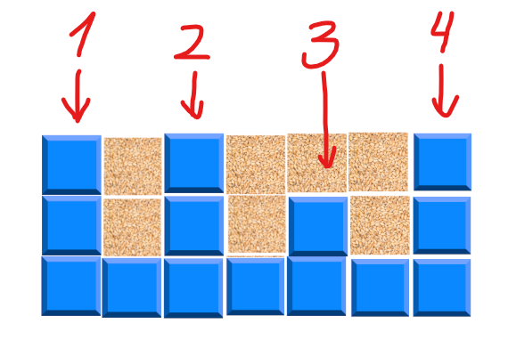
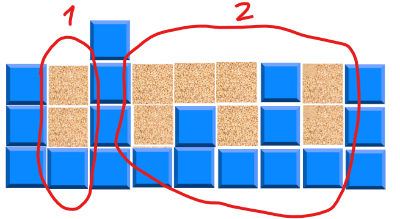
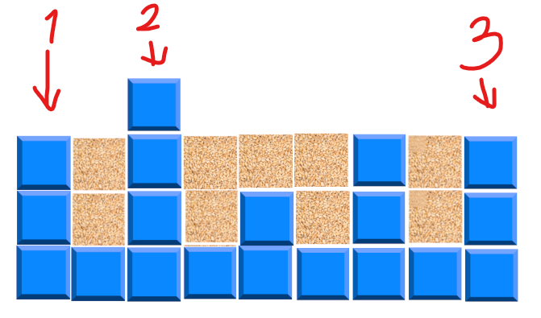

<h1>Про мою реалізацію loadGrain</h1>

Давайте визначемо декілька термінів:

- Стінка - рівень баржі вищий від двох сусідніх (локальний максимум масиву levels)

рис.1: 1, 2, 3 та 4 - стінки

- Відсік - частина баржі, яка обмежена двома стінками, містить лише стінки не вищі(!) від тих, що обмежують відсік та не містять інших відсіків.

рис.2: 1 та 2 - відсіки

- Бар'єр - стінка, яка обмежує відсік

рис.3: 1, 2 та 3 - бар'єри

<h2>Про знаходження загального об'єму зерна</h2>

Об'єм зерна, яке ми можемо засипати в баржу рівний сумі об'ємів зерна, що ми можемо насипати на кожен рівень.

Ми не можемо сипати зерно на бар'єр. Зерно може засипатися лише у(на) відсіки. Об'єм зерна, яке ми можемо насипати на рівень відсіку, рівний різниці максимальної висоти засипання зерна в відсік і висоти даного рівня.
Максимальна висота засипання зерна в відсік рівна висоті нижчого із бар'єрів відсіку.

Отже для того, щоб обрахувати об'єм зерна, яке ми можемо засипати в баржу, перш за все слід знайти усі бар'єри, потім для кожного відсіку визначити максимальний рівень засипання, знайти об'єм зерна який можна засипати на кожен рівень і віднайти їх суму.

<h2>Про аргоритм знаходження бар'єрів.</h2>

Шукати бар'єри будемо зліва на право. Нехай існує нульовий бар'єр висотою 0. 

Далі ітеруємо по масиву рівнів і якщо, поточний рівень вищий від наступного - припустимо що він є стінкою.

Якщо він до того ж не вищий від попереднього бар'єру - він може бути бар'єром. Запишемо його до списку кандидатів на бар'єр, перед тим видаливши з цього списку всіх інших кандидатів нижчих від поточного, починаючи з кінця.

Якщо ж поточний рівень вижчий і від наступного рівня і від попереднього бар'єра - він є бар'єром, адже відсік, який починається після попереднього бар'єра не може містити поточний рівень за визначенням, а отже закінчується на ньому. Записуємо поточний рівень до списку бар'єрів і очищуємо список кандидатів на бар'єр 

Якщо поточний рівень - нижчий від наступного, він не є стінкою, а отже і не може бути бар'єром, отже ми його просто ігноруємо.

Перебравши всі рівні, можливо, що в списку кандидатів на бар'єр залишаться рівні, вони - є бар'єрами додамо їх до списку.

